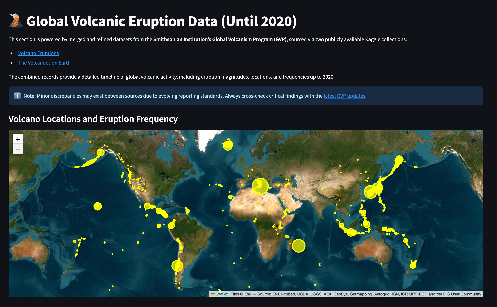
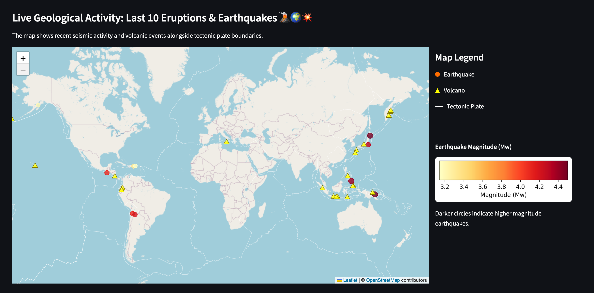
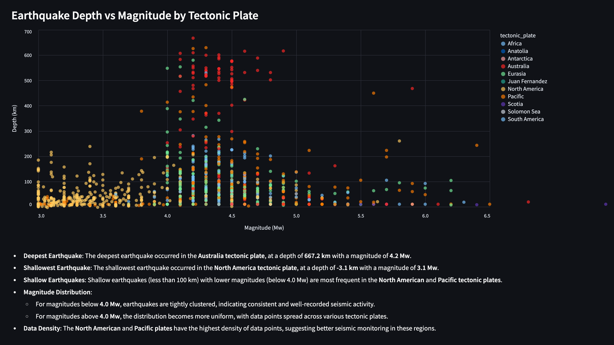

# 🌋 Global Volcanic & Seismic Activity Monitor

_Visualizing tectonic activity with live data and historical context_


## Overview

An interactive map tracking **seismic activity** and **volcanic eruptions** worldwide, highlighting their relationship with tectonic plates. Perfect for researchers, educators, and geology enthusiasts.

## Key Features

| Feature                     | Description                                                              |
| --------------------------- | ------------------------------------------------------------------------ |
| 🔥 **Live Earthquake Data** | Last 10 significant quakes (USGS API) with magnitude/depth visualization |
| 🌋 **Volcano Alerts**       | Weekly eruption reports (Smithsonian GVP) with status levels             |
| 🗺️ **Tectonic Context**     | Plate boundaries overlay + Pacific Ring of Fire highlight                |
| 📊 **Interactive Markers**  | Color-scaled circles (quakes) ▲ Triangles (volcanoes)                    |
| 🎨 **Multiple Themes**      | Dark, Satellite, Topographic, and minimalist styles                      |

## Tech Stack

```python
Folium        → Dynamic map rendering
Streamlit     → Web dashboard framework
Pandas        → Data processing
GeoJSON       → Plate boundary visualization
USGS API      → Real-time earthquake data
BeautifulSoup → Scrap Reports from the Global Volcanism Program
```

## Quick Start

1. Clone the repo:

```
git clone https://github.com/yourusername/seismic-monitor.git
```

2. Install dependencies:

```
pip install -r requirements.txt
```

3. Launch the app:

```
streamlit run 0_🌍_Overview.py
```

## Data Sources

Earthquakes:

- [USGS Earthquake API](https://earthquake.usgs.gov/fdsnws/event/1/query")

Volcanoes:

- [Smithsonian GVP](https://volcano.si.edu/)
- [Volcano Eruptions](https://www.kaggle.com/jessemostipak/volcano-eruptions)
- [The Volcanoes on Earth](https://www.kaggle.com/deepcontractor/the-volcanoes-of-earth)

Tectonic Plates:

- [Github Repository](https://github.com/fraxen/tectonicplates/tree/master)

## Screenshots





